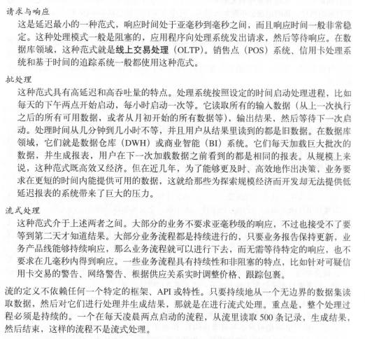

# 11.流式处理
## 1.什么是流式处理
数据流：是无边界数据集的抽象表示。 

无边界意味着无限和持续增长。随着时间的推移，新纪录会不断加入进来。

其他属性：

	事件是有序的
	不可变的数据记录
	事件流是可重播的

流式处理是指实时的处理一个或多个事件流。	流式处理是一种编程范式。

只要持续地从一个无边界的数据集读取数据，然后对它们进行处理并生成结果，那就是在进行流式处理。

## 2. 流式处理的一些概念
### 2.1 时间
大部分流式应用的操作都是基于时间窗口的。例如，流式应用可能会计算股价的5分钟移动平均数。

事件时间

	是指所追踪时间的发生时间和记录的创建时间。
	Kafka 0.10.0之后可以启动自动添加时间戳功能，而事件发生时间需要自己单独设置
	
日志追加时间

	指事件保存到broker的时间

处理时间

	指应用程序在收到事件之后要对其进行处理的时间。
	
#### 注意时区问题
整个数据管道应该使用同一个时区，如果时区问题不可避免，那么处理事件之前需要将它们转换到同一个时区，这就要求记录里同时包含时区信息。
### 2.2 状态
单独处理事件很简单，如从kafka取在线购物交易事件流，找出金额超过1000万美元的交易。并邮件给销售人员。使用Kafka消费者客户端和SMTP库几行代码就可以解决。

多个事件，如根据数据类型计算事件的数量、移动平均数、合并两个流以便生成更丰富的流。

只是处理单个事件是不够的，用户需要跟踪更多信息，比如1小时内看到的每个类型事件的个数、需要合并的事件等。

事件与事件之间的信息被称为“状态”。

这些状态一般被保存在本地变量里。而用户需要持久化，重启可恢复。

流式处理包含以下几种类型状态

本地状态或内部状态
	
	单个应用程序实例访问，内嵌在数据库管理维护
	流式处理很多设计模式都将数据拆分到多个子流，这样就可以使用有限的本地状态来处理它们
	
外部状态
	
	使用外部数据存储维护，一般使用NoSQL系统。

### 2.3 流和表的二元性
流包含了变更 -- 流是一系列事件，每个事件就是一个变更。

表包含了当前的状态，是多个变更所产生的结果。

### 2.4 时间窗口
窗口大小

窗口移动频率（移动间隔）

	移动间隔=窗口大小	  => 滚动窗口
	窗口随每一条记录移动  => 滑动窗口
							 跳跃窗口

窗口的可更新时间多长

窗口可以与时间对齐，也可以任意时间启动

## 3.流式处理的设计模式
### 3.1单个事件处理
最基本的模式，也叫map 或 filter模式，因为它经常被用于过滤无用的事件或者用于转换事件。 

	map 源于Map-Reduce模式，map阶段转换事件，reduce阶段聚合转换过的事件。

这种模式下，应用程序读取流中的事件，修改它们，然后把事件生成到另一个流上。

### 3.2使用本地状态
实现聚合操作，维护流的状态

内存使用、持久化、再均衡

### 3.3 多阶段处理和重分区
比如找到每天的“前10支”股票。

	需要一个两阶段解决方案。
	首先极端每支股票当天的涨跌，这个可以在每个实例上进行。然后将结果写到一个包含了单个分区的新主题上。
	另一个单独的应用实例读取这个分区，找出当天的前10支股票。

### 3.4 使用外部查找 -- 流和表的连接
有时候，流式处理需要将外部数据和流集成在一起，比如使用保存在外部数据库里的规则来验证事务，或者将用户信息填充到点击事件当中。

流式处理每秒处理10~50万时间，而外部数据库正常只能处理1万个，需要伸缩性更强的解决方案。

解决：将数据库的信息缓存到流式处理应用程序里。捕捉数据库的变更事件，并形成事件流，流式处理作业可以监听事件流，并及时更新缓存。

### 3.5流与流的连接		（基于时间窗口的连接）
连接两个流，连接所有的历史事件 -- 将两个流里具有相同键和发生在相同时间窗口内的事件匹配起来。

相同的键来区分和连接。

Streams在内嵌的RocksDB里维护了两个主题的连接时间窗口，所以能够执行连接操作。

### 3.6乱序的事件
乱序：移动设备断开WiFi几个小时，在重新连接之后将几个小时发生的事件一起发送出去。

为了让流处理应用程序处理好这些场景，需要

	识别乱序的事件
	具有在一定时间段内重排乱序事件的能力
	具备更新结果的能力

Dataflow Streams 都支持独立处理事件发生的事件。为开发者提供配置时间窗口大小的能力，时间窗口越大，维护本地状态需要的内存也越大。

Streams API通常将聚合结果写到主题上，这些主题一般是压缩日志主题。它们只保留每个键的最新值。	

### 3.7重新处理
（1）对流式处理应用进行改进，使用新版本应用处理同一个事件流，生成新的结果，并比较两种版本的结果，然后在某个时间点将客户端切换到新的结果流上。 

* 将新版本的应用作为一个新的消费者群组
* 让它从输入主题的第一个偏移量开始读取数据
* 检查结果流，在新版本的处理作业赶上进度时，将客户端应用程序切换到新的结果流上
建议使用此版本来处理

（2）现有流式应用出现了缺陷，修复缺陷后重新处理事件流并重新计算结果。

