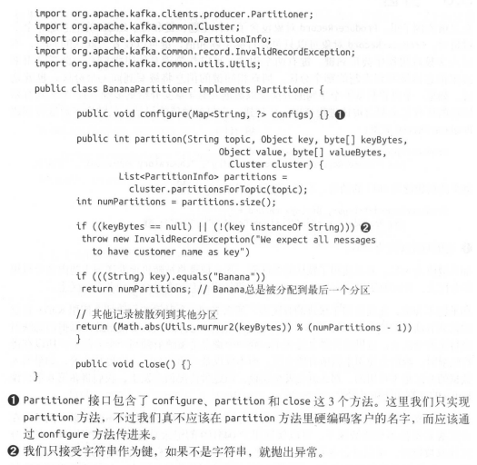

 ## 3.Kafka生产者
### 3.4 生产者的配置
1.acks 制定必须要多少分区副本收到消息，生产者才认为消息写入成功。

    acks =0  不必等服务器响应
    acks =1 首领节点收到消息，生产者就会收到成功响应
    acks =all 所有节点收到消息才会收到响应

2.buffer.memory

生产者内存缓冲区大小

3.compression.type

消息发送时压缩算法，默认不压缩

4.retries

>生产者可以重发消息的次数
>默认重试间隔等待100ms，可通过retry.backoff.ms修改
>生产者自动重试，逻辑代码没必要处理那些可重试的错误。

5.batch.size

指定一个批次可以使用的内存大小，按照字节数计算（而不是消息数）。

6.linger.ms

批次等待时间上限

7.client.id

服务器消息标识

8.max.in.flight.requests.per.connection

生产者在收到服务器响应之前可以发送多少个消息。

设为1时可以使消息有序

9 timeout.ms broker 等待同步副本返回消息确认的时间

request.timeout.ms  生产者在发送数据时等待服务器返回响应的时间

metadata.fetch.timeout.ms 生产者在获取元数据（比如目标分区的首领是谁）时等待服务器返回响应的时间

10、max.block.ms 

在调用send()方法或使用 partitionsFor()方法获取元数据时生产者的阻塞时间。

11 max.requeset.size

控制生产者发送的请求大小。

broker对可接收的消息最大值也有自己的限制 （message.max.bytes）,所以两边的配置最后匹配

12 buffer
>receive.buffer.bytes 	TCP socket接收数据包的缓冲区大小
>
>send.buffer.bytes		TCP socket发送数据包的缓冲区大小

3.5序列化器

在Kafka里使用Avro

3.6分区

键 ：可以作为消息的附加信息，也可以用来决定消息被写到主题的哪个分区。
拥有相同键的消息将被写到同一个分区。

默认分区器使用轮询算法将消息均衡的分布到各个分区。

如果键不为空，Kafka将对键进行散列，然后根据散列值把消息映射到特定的分区上。

如果要使用键来映射分区，那么最好在创建主题的时候就把分区规划好，而且永远不要增加新分区。

实现自定义分区策略

