## 4.kafka消费者
### 4.1 消费者和消费者群组

    注意：不要让消费者的数量大于主题分区的数量，否则多余的消费者只会闲置。
    横向伸缩Kafka消费者和消费者群组并不会对性能造成负面影响。多个群组之间互不影响。
    群组里的消费者共同读取主题的分区。

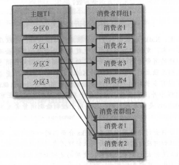

    分区的所有权从一个消费者转移到另一个消费者，这样的行为被称为再均衡。
    再均衡为消费者群组带来了高可用性和伸缩性。
    在再均衡期间，消费者无法读取消息，造成整个群组一小段时间不可用。
    另外，当分区重新分配给另一个消费者时，消费者当前的读取状态会丢失，它有可能还需要取刷新缓存，在它重新恢复状态之前 会拖慢应用程序。

消费者通过向被指派为群组协调器的broker发送心跳来维持它们和群组的从属关系以及它们对分区的所有权关系。、

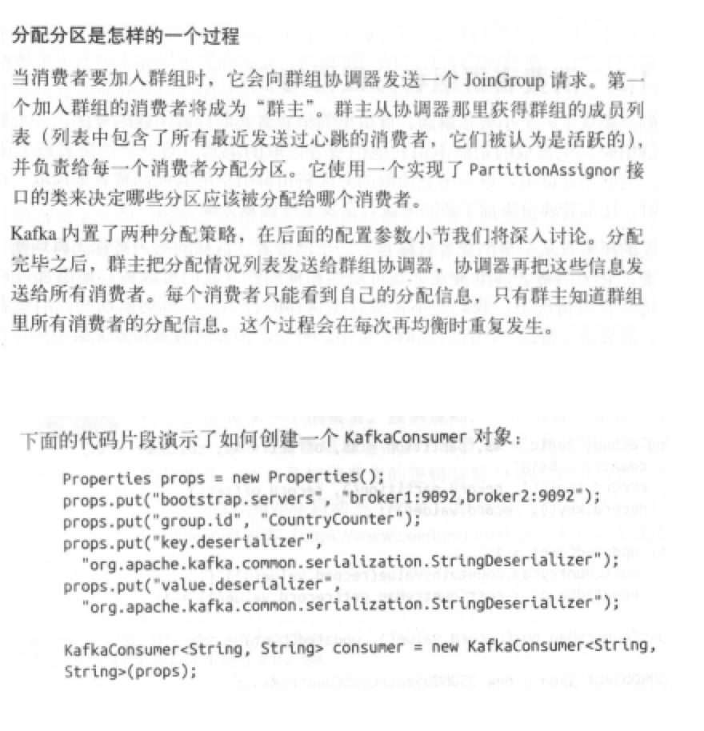

somsumer.subscribe(Collections.singletonList("customerCountries"));

### 4.3订阅主题
调用subscribe()方法时可以传入一个正则表达式。

在Kafka和其他系统之间复制数据时，使用正则表达式。

comsumer.subscribe("test.*");

### 4.4轮询
一旦消费者订阅了主题，轮询就会处理所有的细节，包括群组协调、分区再均衡、发送心跳和获取数据。

[confluent.io/blog](https://www.confluent.io/blog/)

## 4.5消费者配置
1.fetch.min.bytes

消费者从服务器获取记录的最小字节数

2.fetch.max.wait.ms

broker的等待时间，默认500ms

3.max.partition.fetch.bytes

服务器从每个分区返回给消费者的最大字节数,默认1M

如果一个主题有20个分区和5个消费者，那么每个消费者需要至少4MB的可用内存来接收记录。

max.partition.fetch.bytes 值必须比 broker 能够接收的最大消息的字节数（max.message.size）大，否则消费者可能无法读取这些消息。

另外，要注意消费者处理数据的时间。消费者需要频繁调用pull()方法来避免回话过期和发生分区再均衡。如果单词调用poll()返回的数据太多，消费者需要更多时间来处理。

4.session.timeout.ms

消费者在被认定为死亡之前可以与服务器断开连接的时间，默认是3s

该属性与heartbeat.interval.ms紧密相关，一般需要同时修改这两个属性。

    heartbeat.interval.ms指定了poll()方法向协调器发送心跳的频率。
    session.timeout.ms指定消费者可以多久不发送心跳。
    heartbeat.interval.ms一般是session.timeout.ms的三分之一。
    设置的值小，可以更快的检测和恢复崩溃节点。设置的大可以减少意外的再均衡。

5.auto.offset.reset

    指定消费者在读取一个没有偏移量的分区或者偏移量无效的情况下该作何处理。
    默认值是latest，意为在偏移量无效的情况下，消费者从最新的记录开始读取数据（消费者启动之后生成的记录）。
    earliest 表示 ，偏移量无效的情况下，消费者从起始位置读取分区记录。

6.enable.auto.commit

指定消费者是否自动提交偏移量，默认true。还可以通过auto.commit.interval.ms来控制提交的频率。

7.partition.assignment.strategy

分区会被分配给群组里的消费者。PartitionAssignor根据给定的消费者和主题，决定哪些分区应该被分配给哪个消费者。

分配策略：

    Range：该策略会把主题的若干个连续的分区分配给消费者。默认。
    RoundRobin：该策略把主题的所有分区逐个分配给消费者。

    org.apache.kafka.clients.consumer.RangeAssignor
    org.apache.kafka.clients.consumer.RoundRobinAssignor

8.client.id

broker 用它来标识从客户端发送过来的消息，通常被用在日志、度量指标和配额里。

9.max.poll.records

控制单次调用call()方法能够返回的记录数量

10.receive.buffer.bytes 和 send.buffer.bytes

socket在读写数据时用到的TCP缓冲区大小， -1 使用操作系统的默认值。

## 4.6 提交偏移量、再均衡监听器

 提交和偏移量、再均衡监听器

4.6 提交和偏移量

消费者可以使用Kafka来追踪消息在分区里的位置（偏移量）

我们把更新分区当前位置的操作叫做提交。

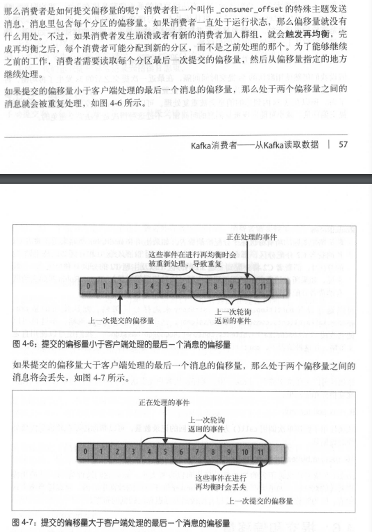

1.自动提交

两次提交偏移量期间发生再均衡，导致重复处理消息，无法避免。

2. 提交当前偏移量

    把 auto.commit.offset 设为false，使用 commitSync() 提交偏移量。
    commitSync() 提交由poll()方法返回的最新偏移量，成功马上返回，失败抛异常。

    不足：在broker 作出回应之前，应用程序一直阻塞。

3. 异步提交

不足：在成功提交或碰到无法恢复的错误之前，commitSync() 会一直重试，但是 commitAsync()不会重试。

commitAsync() 也支持回调，常被用于记录提交错误或生成度量指标。

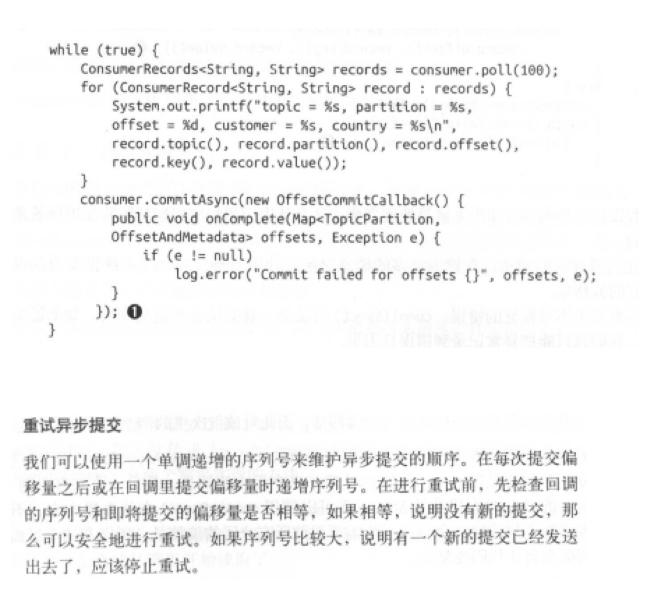

4.同步和异步组合提交

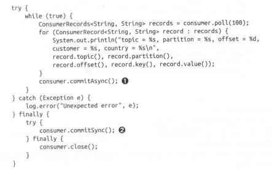

5. 提交特定的偏移量
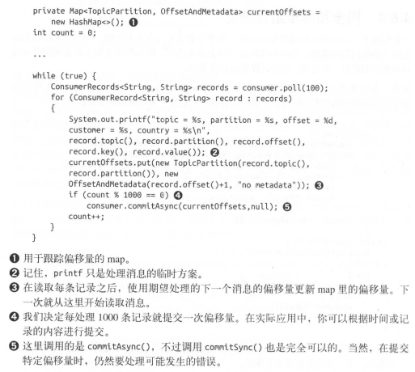

4.7再均衡监听器
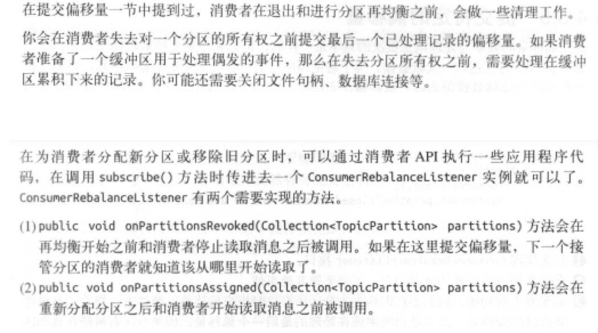

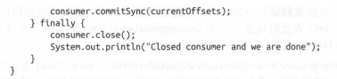

4.8 从特定偏移量处开始处理记录
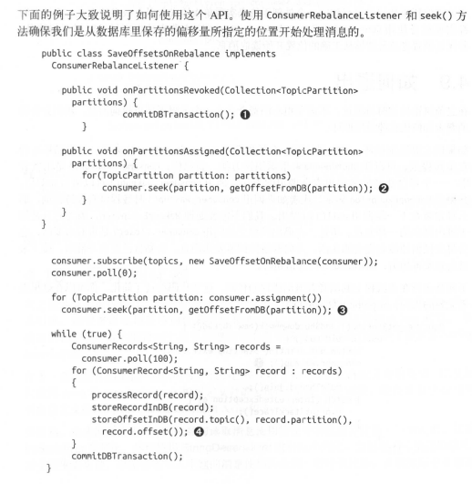
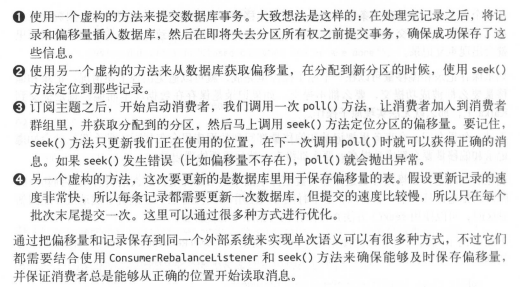

4.9 退出循环
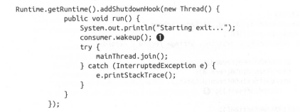
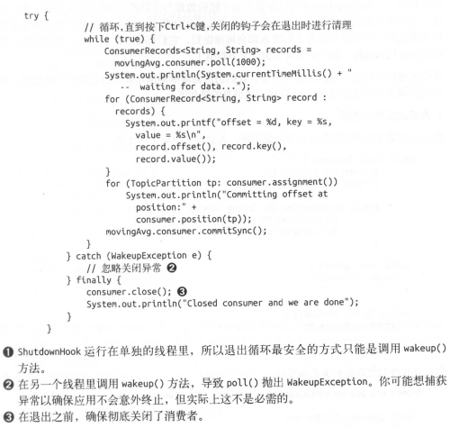

4.11独立消费者

一个消费者可以订阅主题（并加入消费者群组），或者为自己分配分区，但不能同时做这两件事。

如果主题增加了新分区，消费者并不会收到通知。所以需要周期性的调用sonsumer.partitionsFor()检查，或者在添加新分区后重启应用程序。

