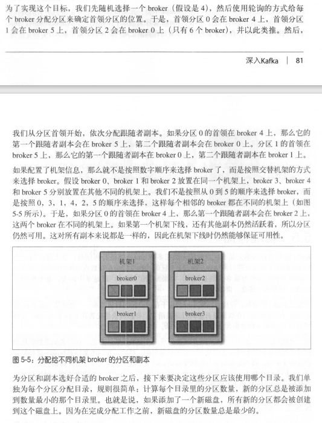

## 5深入kafka
### 5.1 集群成员关系

broker 启动时，通过创建临时节点把自己的ID注册到ZooKeeper。

kafka组件订阅 ZooKeeper 的 /brokers/ids 路径（broker在ZooKeeper上的注册路径），当有broker加入集群或退出集群时，这些组件就可以获得通知。

### 5.2 控制器

控制器是具有分区首领选举功能的broker。

集群里第一个启动的broker在ZooKeeper创建临时节点/controller 让自己称为控制器。其他broker启动时也尝试创建，只不过均失败。

其他broker在控制器节点上创建 ZooKeeper watch对象，这样可以收到节点变更通知。

控制器被关闭或断开时，其他broker通过watch获知，它们尝试成为新的控制器。直到新的控制器产生，其他节点收到“节点已存在”的异常，然后再次创建watch对象。

每个新选出的控制器通过ZooKeeper的条件递增操作获得一个全新的、数值更大的controller epoch，其他broker 知道当前controller epoch后收到旧epoch消息就会忽略。

控制器发现一个broker已经离开集群（通过观察相关的ZooKeeper路径），就会知道失去首领的分区需要新首领。

控制器遍历这些分区，并确定谁应该成为新首领。然后向所有包含新首领或现有跟随者的broker发送请求。该请求包含了谁是新首领以及谁是分区跟随者的信息。随后，新首领开始处理来自生产者和消费者的请求，而跟随者开始从新首领哪里复制消息。

当控制器发现一个broker加入集群时，它会使用broker ID 来检查新加入的broker是否包含现有分区的副本。

如果有，控制器就把变更通知发送给新加入的broker和其他broker，新broker上的副本开始从首领哪里复制消息。

简而言之，Kafka使用ZooKeeper的临时节点来选举控制器，并在节点加入集群或退出集群时通知控制器。

控制器负责在节点加入或离开集群时进行分区首领选举。

控制器使用epoch 来避免脑裂。

### 5.3 复制

同步失败原因：网络拥塞导致复制变慢、broker发生崩溃导致复制滞后，知道重启broker后复制才会继续。

### 5.4处理请求
元数据请求，包含客户端感兴趣的主题列表，服务器端的响应消息里指明了这些主题包含的分区、每个分区都有哪些副本，以及哪个是副本首领。

客户端会把这些信息缓存起来，并直接往目标broker 上发送生产请求和获取请求。

1、生产请求

包含首领副本的broker在收到生产请求时，会对请求做一些验证：

发送数据的用户是否有主题写入权限

请求里包含的acks值

之后，消息被写入本地磁盘。依赖复制功能来保证消息的持久性

2、获取请求

Kafka使用零复制技术向客户端发送消息。（直接从文件里发送到网络通道）

客户端可以设置返回数据的上限和下限。超时时间

在消息还没有被写入所有同步副本之前，是不会发送给消费者的--尝试获取这些消息的请求会得到空的响应而不是错误。

3、其他请求

升级客户端之前先升级broker

### 5.5 物理存储

Kafka基本存储单元是分区。

单磁盘：JBOD

多磁盘：RAID

1. 分区分配

机架

broker 首领/副本

轮询

交替机架

分区使用目录

2.文件管理

数据保留期限

数据量大小

正在写入数据的片段（活跃片段）不会被删除

3.文件格式

键、值、偏移量、消息大小、校验和、消息格式版本号、压缩算法、时间戳

批次消息压缩

DumpLogSegment工具，查看消息偏移量、校验和、魔术数字节、消息大小和压缩算法

启动：bin/kafka-run-class.sh kafka.tool.DumpLogSegments

--deep-iteration 显示被压缩到包装消息里的消息

4.索引

每个分区维护一个索引

索引损坏，kafka会通过重新读取消息并录制偏移量和位置来重新生成索引。

5.清理

根据设置的时间保留数据，超时数据删除。

kafka通过改变主题的保留策略来保存崩溃前的状态。

6.清理原理

干净部分：之前被清理过，每个键只有一个对应值

污浊部分：上次清理之后写入的。

启动清理功能时，每个broker 启动一个清理管理器线程和多个清理线程，他们负责执行清理任务。

清理线程读取分区的污浊部分，并在内存创建一个map。

map里每个元素包含了消息键的散列值和消息的偏移量

键的散列值16B，加上偏移量总共是24B。如果要清理一个1GB的日志片段，并假设每个消息大小为1KB，那么这个片段包含100w个消息，而我们只需要24MB的map就可以清理这个片段。

管理员可以对map使用的内存大小配置。每个线程都有自己的map，这个参数指的是所有线程可用的内存总大小。

假如为map分配1GB内存，使用5个线程清理，每个线程可以使用200MB内存创建自己的map。

kafka要求至少有一个完整的片段符合这个map的大小。

如果不符合，kafka就会报错，要么分配更多内存，要么减少清理线程的数量。

如果只有少部分片段可以完全符合，kafka将从最旧的片段开始清理，等待下一次清理剩余的部分。

清理线程创建好偏移量map后，开始从干净的判断读取消息，从最旧的消息开始，把它们的内容与map里的内容对比。

它会检查消息的键是否存在map中，不存在则消息是最新的，把消息复制到替换片段上。

消息已存在，消息被忽略。

复制完所有消息后，将替换片段与原始片段进行交换，然后开始清理下一个片段。

7.被删除的事件

删除特定键对应的所有消息：

应用程序发送一个包含该键且值为null的消息（墓碑消息）。

清理线程发现后先常规清理，只保留值为null的消息。

此时消费者可以看到这个墓碑消息，并且发现值已经被删除。于是消费者处理墓碑消息时从数据库删除相关数据。

重要的是：留给消费者足够的时间，看到并处理墓碑消息。

8.何时清理主题

kafka会在包含脏记录的主题数量达到50%时进行清理。

管理员也可以对它进行调整

